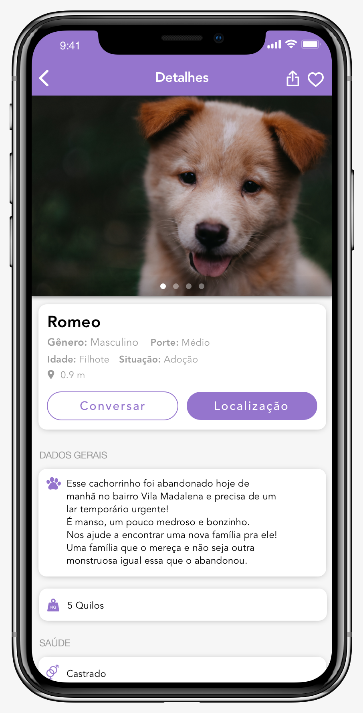

<p align="center"></p>


# PetsGO
O presente aplicativo foi desenvolvido no âmbito social, com o intuito de auxiliar no processo de doação e adoção de animais domésticos (cachorro e gato)Destinado à pessoas que querem ajudar quando encontram um animalzinho abandonado nas ruas, no entanto, não sabem como agir, o PetsGo veio para facilitar e centralizar um ambiente cujo o único objetivo é esse: encontrar um lar para mais animaizinhos e consequentemente, diminuir a quantidade de animais abandonados nas ruas, que já ultrapassam os 30 milhões. 

   

## Primeiros passos
Essas instruções fornecerão uma cópia do projeto em execução na sua máquina local para fins de desenvolvimento e teste.

### Pré-Requisitos
O que você precisa para instalar esse aplicativo:

```
- Java JDK 8
- Android Studio
- Xcode 7+
```

### Instalando no Android
1. Abra o terminal, vá até a pasta raiz do projeto e execute o seguinte comando: 

```
$ npm install
$ npm run build
```
2. Você precisará instalar o plugin para rodar no Android.

```
$ cordova platform add android
```

3. Depois disso, o seguinte erro irá aparecer:
>Error: **"cannot read property 'manifest' of undefined"**


4. Você precisará modificar a biblioteca: 
>cordova-universal-links-plugins
```
Path: plugins/cordova-universal-links-plugin/hooks/lib/android/manifestWriter.js.
```
5. Em seguida, na linha **21** substitua o código atual, pelo mostrado abaixo:

```js
 var pathToManifest = path.join(cordovaContext.opts.projectRoot, 'platforms', 'android', 'app', 'src', 'main', 'AndroidManifest.xml');
```

 6. Execute novamente o comando abaixo:
 ```
 cordova platform add android
 ```

 **Observação**: Todas as vezes que o comando npm install for rodado, o comando acima precisará ser executado novamente.


### Instalando no IOS

1. Abra o terminal, vá até a pasta raiz do projeto e execute o seguinte comando: 

```
$ npm install
$ npm run build
$ sudo cordova platform add ios
```
2. Execute os próximos comandos:

```
    $ sudo cordova plugin remove cordova-plugin-customurlscheme
    $ sudo cordova plugin add cordova-plugin-customurlscheme     --variable URL_SCHEME=com.vsilverio.petsgo --save
    $ sudo cordova platform add ios
```

3. Depois disso, o seguinte erro irá aparecer:
>"Cannot find module '../../src/plugman/platforms/ios""

4. Acesse a pasta: *plugins/cordova-universal-links-plugin/hooks/lib/ios/xcodePreferences.js*

5. Substitua o código da linha **135** até a **150** pelo código abaixo:

```js
 function loadProjectFile() {
  var platform_ios;
  var projectFile;
  try {
    // try pre-5.0 cordova structure
    platform_ios = context.requireCordovaModule('cordova-lib/src/plugman/platforms')['ios'];
    projectFile = platform_ios.parseProjectFile(iosPlatformPath());
  } catch (e) {
    try {
      // let's try cordova 5.0 structure
      platform_ios = context.requireCordovaModule('cordova-lib/src/plugman/platforms/ios');
      projectFile = platform_ios.parse(iosPlatformPath());
    } catch (e) {
      // try cordova 7.0 structure
      var iosPlatformApi = require(path.join(iosPlatformPath(), '/cordova/Api'));
      var projectFileApi = require(path.join(iosPlatformPath(), '/cordova/lib/projectFile.js'));
      var locations = (new iosPlatformApi()).locations;
      projectFile = projectFileApi.parse(locations);
    }
  }
  return projectFile;
}
```

6. Acesse o Path a seguir:
```
platforms\ios\PetsGo\config.xml 
```
7. Substitua o código existente no Path pelo código abaixo:

```js
"<preference name="CordovaWebViewEngine" value="CDVUIWebViewEngine" />"
```


8. Abra o Xcode e execute o projeto.

**Observação**: Todas as vezes que algo é alterado no projeto e que seja necessario rodar no IOS, é preciso executar um comando para que as alterações sejam atualizadas no projeto.
```
$ sudo ionic cordova ios
```

## Admob-Plus
https://github.com/admob-plus/admob-plus/issues/89
https://github.com/CocoaPods/CocoaPods/issues/6223
https://github.com/chemerisuk/cordova-plugin-firebase-analytics/issues/118

## Pronto! Agora você tem todos os passos para rodar o projeto! 😉


# Authors

* **Vinicius Silverio** - https://github.com/viniciussilverio
* **Jéssica Santos**    - https://github.com/jesantosscruz
* **Yan Luccas**        - https://github.com/yanluccasoliveira
